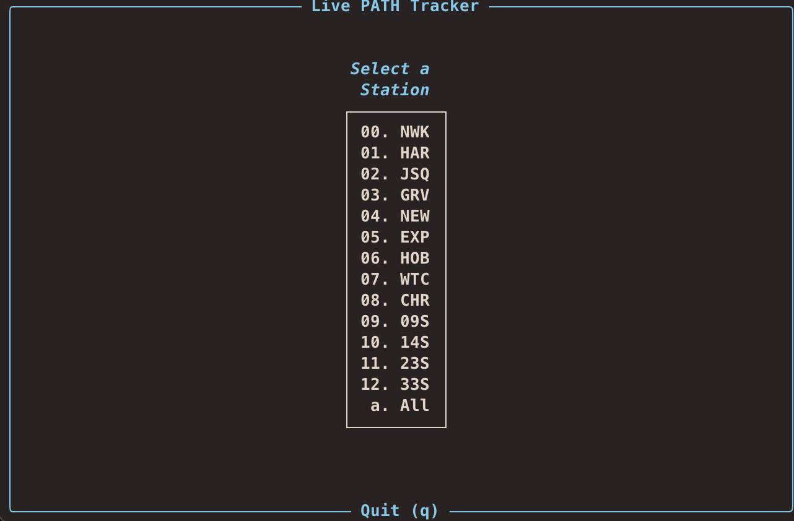
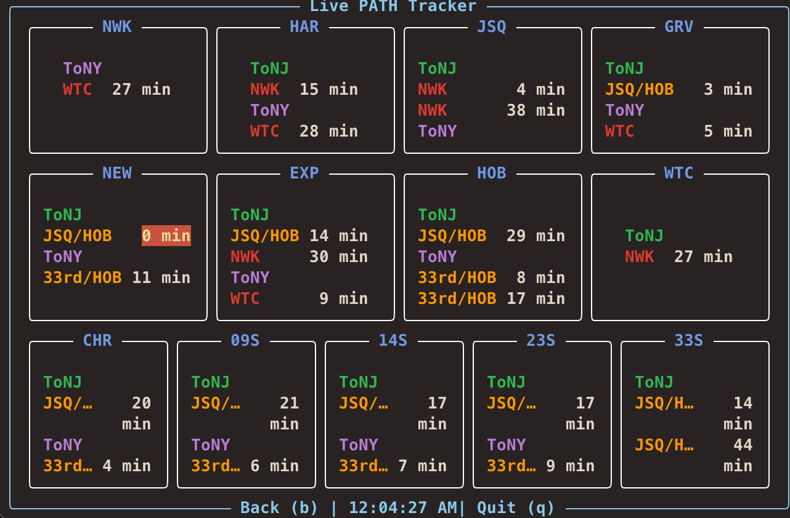

# PATH Train Terminal Tracker

Python terminal program that shows live PATH train arrival times.
It uses the Port Authority PATH JSON feed and displays results in a text user interface (TUI) with the Rich library.
This application makes use of TERMIOS and therefore only runs on POSIX compatible platforms (ie: MacOS, Linux, WSL)

---

## Screenshots

### Main Menu



### Station Dashboard



---

## Features

- Fetches train arrival times from the PATH API.
- Displays stations in a menu with numeric selection.
- Shows arrivals for each station with color formatting.
- Refreshes automatically (API called at most once every 10 seconds).
- Keyboard controls:
  - Numbers + Enter → select station
  - a + Enter → all stations
  - b → back
  - q → quit

---

## Install

### Clone the repository and install dependencies:
```bash
git clone https://github.com/neustater/path-live-tracker-tui.git
cd path-tracker
sudo python3 -m venv .venv
source .venv/bin/activate
pip install -r requirements.txt
```

---

## Run

### Run the program:
```bash
python path.py
```

### Usage Instructions:

- After running, a menu will appear listing all PATH stations.
- Type the station number (e.g., 1) and press Enter to view train arrivals.
- Type a and press Enter to view all stations.
- While viewing a station:
  - Press b to go back to the menu.
  - Press q to quit the program.
- If window is too small arrivals may be cut off

---

## Data Source

### Train data comes from:
https://www.panynj.gov/bin/portauthority/ridepath.json

